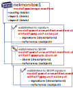

# ORAS Artifacts Specification

[OCI Artifacts][oci-artifacts] generalized the ability to persist artifacts within an [OCI Distribution conformant][oci-conformance] registry enabling a wide range of *individual* artifacts.
The majority of cloud registries, products and projects support pushing and pulling OCI Artifacts to a registry, enabling users to benefit from the performance, security, reliability capabilities. These common registry capabilities avoid the need to run, manage or care for **Y**et **A**nother **S**torage **S**ervice (YASS). 

A focus on storing secure supply chain artifacts, including Software Bill of Materials (SBoM), security scan results and signatures has prompted a new set of capabilities.
Building on OCI Artifacts, the ORAS [artifact.manifest][artifact-manifest-spec] generalizes the use cases of [OCI image manifest][oci-image-manifest] by removing constraints defined on the `image.manifest`, while adding support for references between artifacts.

The ORAS Artifacts specification includes:

1. Storing artifacts, with optional references, through the [artifact.manifest][artifact-manifest-spec]
2. Discovering referenced artifacts, through the [referrers API][artifact-referrers-spec]

## Table of Contents:

  - [Overview](#overview)
  - [Comparing the ORAS Artifact Manifest and OCI Image Manifest](#comparing-the-oras-artifact-manifest-and-oci-image-manifest)
  - [How does ORAS Artifacts relate to OCI Artifacts?](#how-does-oras-artifacts-relate-to-oci-artifacts)
  - [Scenarios](./scenarios.md)
  - [Artifact Manifest Spec](./artifact-manifest.md)
  - [referrers API](./manifest-referrers-api.md)
  - [Project status](#project-status)
  - [Community](#community)
  - [Code of Conduct](#code-of-conduct)

## Overview

As the distribution of secure supply chain artifacts becomes a primary focus, users and registry operators are looking to extend the capabilities for storing artifacts including artifact signing, SBoMs and security scan results. 
To provide these capabilities, the [ORAS Artifacts Spec][artifact-manifest-spec] will provide a specification for storing and discovering a broad range of types, including the ability to store references between types, enabling a graph of objects that registry operators and client can logically reason about.

The ORAS Artifacts specs will build upon the [OCI distribution-spec][oci-distribution] assuring registry operators can opt-into the behavior, ensuring users and clients have well understood expectations for the lifecycle management capabilities for storing artifacts and the references between artifacts.

The approach to reference types is based on a new [artifact.manifest][artifact-manifest-spec], enabling registries and clients to opt-into the behavior, with clear and consistent expectations.

## Comparing the ORAS Artifact Manifest and OCI Image Manifest

OCI Artifacts defines how to implement stand-alone artifacts that can fit within the constraints of the image-spec. ORAS Artifacts uses the `manifest.config.mediaType` to identify the artifact is something other than a container image. While this validated the ability to generalize the **C**ontent **A**ddressable **S**torage (CAS) capabilities of [OCI Distribution][oci-distribution], a new set of artifacts require additional capabilities that aren't constrained to the image-spec. ORAS Artifacts provide a more generic means to store a wider range of artifact types, including references between artifacts.

The addition of a new manifest does not change, nor impact the `image.manifest`.
By defining the `artifact.manifest` and the `referrers/` api, registries and clients opt-into new capabilities, without breaking existing registry and client behavior. 

The high-level differences with the `oras.artifact.manifest` and the `oci.image.manifest`:

| OCI Image Manifest | ORAS Artifacts Manifest |
|-|-|
| `config` REQUIRED | `config` OPTIONAL as it's just another entry in the `blobs` collection with a config `mediaType` |
| `layers` REQUIRED | `blobs` are OPTIONAL, which were renamed from `layers` to reflect general usage |
| `layers` ORDINAL | `blobs` are defined by the specific artifact spec. For example, Helm utilizes two independent, non-ordinal blobs, while other artifact types like container images may require blobs to be ordinal |
| `manifest.config.mediaType` used to uniquely identify artifact types. | `manifest.artifactType` added to lift the workaround for using `manifest.config.mediaType` on a REQUIRED, but not always used `config` property. Decoupling `config.mediaType` from `artifactType` enables artifacts to OPTIONALLY share config schemas. |
| | `subject` OPTIONAL, enabling an artifact to extend another artifact (SBOM, Signatures, Nydus, Scan Results)
| | `/referrers` api for discovering referenced artifacts, with the ability to filter by `artifactType` |
| | Lifecycle management defined, starting to provide standard expectations for how users can manage their content |

For more info, see: [Discussion of a new manifest #41](https://github.com/opencontainers/artifacts/discussions/41)

## Project status

The ORAS artifacts-spec is nearing [draft status][release], with the following reference implementations:
- [CNCF Distribution][cncf-distribution-artifacts] (registry) reference implementation
- [ORAS CLI][oras-cli] for pushing, discovering, pulling OCI & ORAS Artifacts
- [Notary - notation CLI][notation], enabling signing of all OCI Artifacts

## ORAS and OCI

ORAS Artifacts are additive capabilities to the OCI [distribution-spec][oci-distribution].

## Community

To engage with the project:

- Slack: [#oras-artifacts-spec](https://cloud-native.slack.com/archives/C02AJS1BUTX)
  - To participate in this channel, join CNCF slack at https://slack.cncf.io/
- Weekly meetings can be found on the CNCF Calendar: [CNCF oras-artifacts-spec][cncf-calendar]

## Code of Conduct

This project has adopted the [CNCF Code of Conduct](CODE_OF_CONDUCT.md).

[cncf-calendar]:                    https://www.cncf.io/calendar/
[oci-artifacts]:                    https://github.com/opencontainers/artifacts
[oci-conformance]:                  https://github.com/opencontainers/oci-conformance/tree/main/distribution-spec
[oci-image-manifest]:               https://github.com/opencontainers/image-spec/blob/main/manifest.md
[oci-distribution]:                 https://github.com/opencontainers/distribution-spec
[cncf-distribution-artifacts]:      https://github.com/oras-project/distribution/
[artifact-manifest-spec]:           ./artifact-manifest.md
[artifact-referrers-spec]:          ./manifest-referrers-api.md
[oras-cli]:                         https://github.com/oras-project/oras/tree/reference-types
[notation]:                         https://github.com/notaryproject/notation
[release]:                          https://github.com/oras-project/artifacts-spec/pull/35