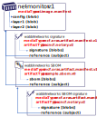

# ORAS Artifacts

[ORAS Artifacts][oci-artifacts] generalized the ability to artifacts within an [OCI Distribution conformant][oci-conformance] registry. The majority of cloud registries, products and projects support pushing and pulling ORAS Artifacts to a registry enabling users to benefit from the performance, security, reliability capabilities. Thus avoiding the need to run, manage or care for **Y**et **A**nother **S**torage **S**ervice (YASS).

As the distribution of secure supply chain content becomes a primary focus, users and registry operators are looking to extend the capabilities for storing artifacts including content signing, SBoMs, artifact security scan results. To provide these capabilities, ORAS Artifacts will provide a specification for storing a broad range of types, including the ability to store references between types, enabling a graph of objects that registry operators and client can logically reason about. The ORAS Artifacts specs will build upon the [OCI distribution-spec][oci-distribution] assuring registry operators can opt-into the behavior, ensuring users and clients have well understood expectations for the lifecycle management capabilities for storing artifacts and the references between artifacts.

## Table of Contents:

- [ORAS Artifacts Manifest Overview][artifact-manifest]
- [ORAS Artifacts Manifest Spec][artifact-manifest-spec]
- [ORAS Artifacts Referrers Spec][artifact-referrers-spec]
- [CNCF Distribution Support for ORAS Artifacts][cncf-distribution-reftypes]
- [ORAS experimental support for oras.artifact.manifest references][oras-artifacts] to `push`, `discover`, `pull` referenced artifact types.

## Q&A

- **Q**: How does ORAS Artifacts relate to ORAS Artifacts?
- **A**: ORAS Artifacts defines how to implement stand-alone artifacts that can fit within the constraints of the image-spec. ORAS Artifacts uses the `manifest.config.mediaType` to identify the artifact is something other than a container image. While this validated the ability to generalize the **C**ontent **A**ddressable **S**torage (CAS) capabilities of [OCI Distribution][oci-distribution], a new set of artifacts require additional capabilities that aren't constrained to the image-spec. ORAS Artifacts provide a more generic means to store a wider range of artifact types, including references between artifacts.

[oci-artifacts]:              https://github.com/opencontainers/artifacts
[oci-conformance]:            https://github.com/opencontainers/oci-conformance/tree/main/distribution-spec
[oci-distribution]:           https://github.com/opencontainers/distribution-spec
[cncf-distribution-reftypes]: https://github.com/notaryproject/distribution/blob/reference-types/docs/reference-types.md
[artifact-manifest]:          ./artifact-manifest.md
[artifact-manifest-spec]:     ./artifact-reftype-spec.md
[artifact-referrers-spec]:    ./manifest-referrers-api.md
[oras-artifacts]:             https://github.com/deislabs/oras/blob/prototype-2/docs/artifact-manifest.md