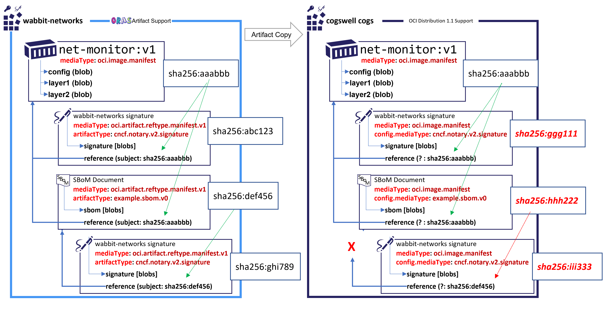

# Reference Type Requirements

The ability to distribute and consume supply chain artifacts has driven a new set of requirements for adding information within an OCI Registry. [OCI Artifacts](https://github.com/opencontainers/artifacts/) enabled new, independent artifacts. [ORAS Artifacts](README.md) enables supply chain scenarios such as signatures, systems bill of materials (SBoM), security scan results and attestations.

The [ORAS Artifacts spec](https://github.com/oras-project/artifacts-spec/) accounts for these new reference types, however it does require support from registries to implement the new [artifact manifest](artifact-manifest.md), and the new [referrers api](manifest-referrers-api.md) to discover artifacts that refer to a given digest and/or tag.

To account for registries that have not yet implemented ORAS Artifacts, a fallback design will be provided. The assumption is the fallback will have some tradeoffs, as a fallback that implements the full set of requirements would question why a new manifest and referrers api would be required.

The following captures the scenarios as a comparison for different proposals. The proposals should account for zero changes to registries that implement the [OCI Distribution-spec 1.1 ](https://github.com/opencontainers/distribution-spec/releases/tag/v1.0.1) to the full [ORAS Artifacts spec](README.md). Based on a set of proposals, a fallback design will be chosen, documented so ORAS Artifacts may be promoted to/from OCI 1.1 registries to registries that implement the ORAS Artifacts spec.

## Definitions

- **Artifact** - One conceptual piece of content stored as one or more blobs, represented by a Manifest. An artifact has a distinct lifecycle, represented by an associated tag.  
*(Examples: container images, wasm, helm charts)*
- **Reference Type** - One or more additional (detached) pieces of content, that enhances the content of referenced artifact without mutating referenced artifact. A reference type may contain blobs for larger content, but it may also be limited to signed annotations, providing attestations to a referenced artifact.  
*(Examples: signatures, SBoM, security scan results, policies, attestations)*
- **Subject** - Reference types are added to existing artifacts. As a reference is added, the artifact it references is call the **`subject`**.

## Scenarios

The following list of scenarios highlight the scenarios impacted by enabling 1.1 registry fallback experiences.
Not all design options will serve all scenarios. The goal is to serve as many critical scenarios for existing and unchanged [OCI Distribution-spec 1.1 ](https://github.com/opencontainers/distribution-spec/releases/tag/v1.0.1) based registries, comparing to a full feature implementation.

The scenarios account for integration scenarios where an artifact, and the graph of its references may be promoted across [OCI Distribution-spec 1.1 ](https://github.com/opencontainers/distribution-spec/releases/tag/v1.0.1) based registries, with fallback support, to registries that support [ORAS Artifacts](README.md)

As reference: ORAS artifact reference type scenarios are covered [here](scenarios.md).

### Scenario 1: Non mutating tag/digest

The development team uses tags or digests for their container references in their service deployment documents. Adding a signature, SBoM, scan result, attestation or other reference must not change the tag or digest references.

### Scenario 2: Pushing Independent Reference Types

The `net-monitor:v1` image is pushed to the registry as part of a build system. A [detached signature is pushed](./scenarios.md#notary-v2-signatures) attesting to where the image was built. The detached signature is pulled, independently from the image to validate the signature without having to pull the container image. 

### Scenarios 3: Pushing multi-level Reference Types

As the `net-monitor:v1` image is pushed to the registry, a notification triggers a security scanner. The security scanner results are pushed to the registry, referencing the `net-monitor:v1` image. The scan results are signed, which is persisted as a detached nested reference of the SBoM.

Within the build system, an SBoM is generated alongside the container image. The image, image signature, SBoM and SBoM signature are all pushed tto the registry as a graph of artifacts.

### Scenarios 4: Support for Tag Locking (Immutable Tags)

Many registries support the ability to lock a tag to a given digest. ([acr: lock an image by tag](https://docs.microsoft.com/en-us/azure/container-registry/container-registry-image-lock#lock-an-image-by-tag), [ecr: Image tag mutability](https://docs.aws.amazon.com/AmazonECR/latest/userguide/image-tag-mutability.html)]). This pattern precludes the ability to use a alias manifest (change the tag to an index) to represent a level of indirection for a given tag. 

### Scenario 5: Filtered Promotion

An artifact may have periodic scans, multiple signatures, and multiple attestations. As the artifact is built in the dev registry, it may be promoted through staging to production. It may be made public for others to consume. At each stage, a set of reference types will exist, which build up over time. As an artifact is promoted, the consumer may only care about the most recent scan result, specific signatures, or a specific set of attestations. To promote the subset of the graph across registries, each reference must be independent, allowing a filtered graph to be promoted.

This requirement is highlighted in the fallback scenarios as it makes using a single manifest to aggregate multiple references a challenge. If a single manifest (or OCI Index) is used to represent multiple artifacts, how is the subset promoted? Are new manifests/indexes expected to be re-created? If so, how does the graph of references maintain their `subject` reference as a digest?

### Scenario 6: Multi-blob Support

[OCI Artifacts][oci-artifacts] leverages the generalized distribution design for an array of `blobs`. This pattern enables flexibility for artifacts to persist a small single file to multiple multi-gigabyte files across multiple blobs. Multiple blobs enables several scenarios, including concurrent downloading, or blob contents to be placed across different directories. Reference types should benefit from this flexibility, and not be restricted to an assumption that a reference type may only have a single blob.

This requirement is highlighted in the fallback scenarios as some proposals have implemented an aggregate of artifacts in a single manifest. For example, as additional signatures are added, each signature is persisted as a different blob within the same manifest. This design precludes scenarios 1-5. It may be a reasonable choice for fallback support, but highlighted as a delta between a degraded fallback and an optimal, long-term experience.

### Scenario 7: Annotation Only Support

There are a set of scenarios that may require minimal content to be added as a reference. Users may wish to add additional metadata to existing artifacts, such as a expiration date, by which the artifact should be purged, or attestations such as the image was SBoM validated, and approved for policy abc123. While these bits of metadata could be persisted as blobs, the additional storage and levels of indirection are unnecessary. These attestations and signatures can be persisted as a set of short length annotations.

### Scenario 8: Lifecycle Management

As users automate builds, the number of artifacts, and reference types, increase at the speed by which developers can automate workflows. Not all content built is intended to be maintained. Users purge content to reduce their storage costs, however the majority of users will want to purge artifacts that aren't active, but have vulnerabilities. Users have a hard enough time trying to figure out which artifacts were built and never deployed, or deployed and must be maintained for x months to enable their compliance requirements. Enabling the registry to understand the graph of artifacts enables automation to promote or purge the entire graph of artifacts. See [ORAS Artifact: Lifecycle Management](./artifact-manifest.md#lifecycle-management) for specifics.

### Scenario 9: Non impactful to Existing Runtimes

Registries were initially built to store and distribute container runtimes. As registries are used to store multiple artifact types, existing container runtimes must not be impacted by accidental deployments. Issuing a deployment of a non-runtime-container based artifact must fail gracefully. The runtime must not attempt to download the artifact, enabling trojan horse style attacks.

### Scenario 10: Pull by Subject Tag/Digest

Workflows are based on the subject artifact, which may be a container image queued for deployment. A deployment document specifies the `registry.acme-rockets.io/net-monitory:v1` container image, which may use a digest in replacement of the tag. An artifact client, such as an SBoM validator, must be able to pull the SBoM that references the `net-monitor:v1` image.  The SBoM validator knows the `artifactType` for the specific SBoM type, which is used to filter the subset of references. For instance, return all the `application/vnd.cncf.notary.v2.signature`s  for the `net-monitor:v1` image. The [ORAS Artifact referrers](manifest-referrers-api.md) API provides for ordered and filtered results. A fallback may implement similar capabilities through other means.

### Scenario 11: Paged and Ordered Referrers

As registries store multiples of a specific artifactType, the ability to page and order the results becomes an important part of the workflow. For example, a registry may persist a collection of scan results. It may be important to keep the history of scan results to understand why a vulnerability wasn't considered a blocker on a given date, as the scan result didn't find it until a more recent scan. While auditing, it may be important to know the initial scan result, to know how the artifact was promoted with a newly discovered vulnerability. By sorting the list of `scan-result/example` references to the `net-monitor:v1` by ascending date, a client can find the first scan result. Likewise, a current deployment likely wants the most recent scan result, which is sorted by descending creation date.

### Scenario 12: Filtered Referrers by Annotation

As registries are used to store multiple signatures or attestations, these are persisted as the same `artifactType`. To provide generic (non-artifact specific knowledge) referrer results, the registry MAY be capable of supporting filtering by `artifactType`, and named `annotations`. Example: `registry.acme-rockets.io/v2/net-monitor/_oras/artifacts/referrers?digest={$DIGEST}&artifactType={$ARTIFACTTYPE}&annotation={$ANNOTATION}`.

Not all registries may choose to implement this level of filtering, even if they implement the [ORAS Artifact referrers API](manifest-referrers-api.md). The artifact client may have to retrieve all references of a given `artifactType`. However, having the option for high-volume registries to implement this capability can reduce egress and network bandwidth.

### Scenario 13: Multi-Region Push Contention

Several registries support geo-replicated instances, where a reference type may be pushed from different nodes to different replicas. A build system may push to `registry.acme-rockets.io/net-monitor` from an east us region, while a security scanner may be load balanced to operate in west us region and the UK SBoM policy validation service may operate in a west UK region. While an argument may be made these workflows may be adequately time spaced to avoid contention, diagnosing these types of problems are frustrating to users, costly to track and implies a lack of trust in the system when they do surface. Most registries that implement replication are based on eventual consistency, as registries maintain immutable content.
The design of independent reference artifacts avoids contention and race condition as all individual artifacts have eventual consistency, where the registry manages the index of references external to the documents and blobs uploaded.

### Scenario 14: OCI Index References

 A signature, attestation, or possibly platform aggregated SBoM may be associated with an OCI Index. While it's debateable if a single SBoM _should_ be used to represent multiple architectures, as opposed to each architecture has its own SBoM, the reference type design should be flexible for other reference types that may be more applicable. For example, [CNAB](https://cnab.io)s are independent artifacts that happen to use OCI index as their representation.

### Scenario 15: Tag Listing Clarity

The ORAS Artifact manifest enables a graph of artifacts to be represented through a top level tag. This maintains existing automated and human workflows where a tag represents the root artifact the user and/or workflow depend upon. 
 A fallback may utilize a tag matching pattern. While is does solve some problems, it introduces others where users expect the tags to represent the primary artifacts, (container image, helm chart, wasm). The expectation a registry may implement patterned tag filtering is in the "registry code change" bucket.

### Scenario 16: Promotion Across Up-level and Downlevel Registries

The distribution and promotion across registries is a fundamental workflow. Users may build their software on-prem, pushing to registry product or project, promoting to a cloud provider for production deployment. IoT scenarios may build in the cloud, and deploy to an on-prem, [purdue nested network](https://en.wikipedia.org/wiki/Purdue_Enterprise_Reference_Architecture) registry for local reliability, security and performance. It's a well understood problem that not all registry implementations and deployments will instantly support the ORAS Artifact manifest. The question is how will the fallback handle uplevel and downlevel transitions. The ORAS Artifact manifest uses the digest of a `subject` to establish a secure, immutable reference between artifacts.

A single level reference, where a signature establishes a `subject` to the container image, may convert easily as the manifest of the signature artifact can mutate.

### Compatible Registry Promotion

In the following example, both the **wabbit-networks** and **acme rockets** registries support the oras artifact manifest. As the manifests are copied across registries, all the digest references are maintained as the manifests are copied without changes.

### Incompatible Registry Promotion

In the following example, the **cogswell cogs** registry does not support the ORAS Artifact manifest. As a result, the manifests must be down converted to `oci.image.manifest`s, or possibly an `oci.image.index`. In either case, the digests of the manifests change. The first level objects (signature and SBoM) are not problematic. While their digest changes, there's nothing referencing these artifacts by digest. They reference the `net-monitor:v1` image, which hasn't changed.

However the sub-nested references (SBoM signature) lose their reference. The SBoM manifest changed, therefore the signature of the SBoM no longer has a valid reference. 

## Comparison of Options

A matrix of designs that support each requirement. The options fall into two buckets:

1. Zero changes to an existing [OCI Distribution-spec 1.1 ](https://github.com/opencontainers/distribution-spec/releases/tag/v1.0.1) based registry.
2. Any expectation of a change, from a tag list filtering to new manifest support or a [referrers api](manifest-referrers-api.md).

The choice of options should be considered a weighted scale, where zero changes are easy, and any changes are hard. Once enhancements are added, the size of the enhancement is non-linear, when comparing to zero. Adding any registry, server-side changes is the largest investment.

| # | Item | Fallback 1 | Fallback 2 | Updates to OCI Manifest/Index Specs | ORAS  Artifact manifest spec|
| - | - | - | - | - | - |
| 0 | Works with [OCI Distribution-spec 1.1 ](https://github.com/opencontainers/distribution-spec/releases/tag/v1.0.1) based registries |  :white_check_mark: | :white_check_mark: | :x:  | :x: |
| 1 | Non mutating tag/digest | :grey_question: | :grey_question: | :grey_question: | :white_check_mark: |
| 2 | Pushing Independent Reference Types |  :grey_question: | :grey_question: | :grey_question: | :white_check_mark: |
| 3 | Pushing multi-level Reference Types |  :grey_question: | :grey_question: | :grey_question: | :white_check_mark: |
| 4 | Support for Tag Locking (Immutable Tags) |  :grey_question: | :grey_question: | :grey_question: | :white_check_mark: |
| 5 | Filtered Promotion |  :grey_question: | :grey_question: | :grey_question: | :white_check_mark: |
| 6 | Multi-blob Support |  :grey_question: | :grey_question: | :grey_question: | :white_check_mark: |
| 7 | Annotation Only Support |  :grey_question: | :grey_question: | :grey_question: | :white_check_mark: |
| 8 | Lifecycle Management |  :grey_question: | :grey_question: | :grey_question: | :white_check_mark: |
| 9 | Non impactful to Existing Runtimes |  :grey_question: | :grey_question: | :grey_question: | :white_check_mark: |
| 10 | Pull by Subject Tag/Digest |  :grey_question: | :grey_question: | :grey_question: | :white_check_mark: |
| 11 | Paged and Ordered Referrers |  :grey_question: | :grey_question: | :grey_question: | :black_square_button: [#82](https://github.com/oras-project/artifacts-spec/pull/82) |
| 12 | Filtered Referrers by Annotation |  :grey_question: | :grey_question: | :grey_question: | :black_square_button: [#72](https://github.com/oras-project/artifacts-spec/issues/72) |
| 13 | Multi-Region Push Contention |  :grey_question: | :grey_question: | :grey_question: | :white_check_mark: |
| 14 | OCI Index References |  :grey_question: | :grey_question: | :grey_question: | :white_check_mark: |
| 15 | Tag Listing Clarity |  :grey_question: | :grey_question: | :grey_question: | :white_check_mark: |
| 16 | Promotion Across Up-level and Downlevel Registries | :grey_question: | :grey_question: | :grey_question: | :grey_question: |

### Key:
| Symbol | Meaning |
| - | - |
| :white_check_mark: | : supported |
| :black_square_button: | : work in progress - list the issue/PR |
| :grey_question: | : research needed |
| :x: | : unsupported |

[oci-artifacts]:            https://github.com/opencontainers/artifacts
