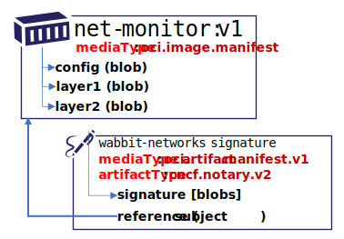
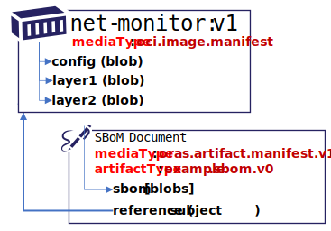
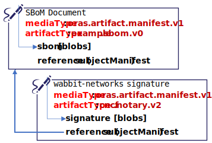
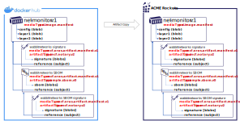

# ORAS Artifact Scenarios

The ORAS [artifact.manifest][artifact-manifest-spec] generalizes the use cases of [OCI image manifest][oci-image-manifest-spec] by removing constraints defined on the `image.manifest`, while adding support for references between artifacts.

The addition of a new manifest does not change, nor impact the `image.manifest`.
By defining a new manifest, registries and clients opt-into new capabilities, without breaking existing registry and client behavior or setting expectations for scenarios to function when the client and/or registry doesn't yet implement the new capabilities.

## ORAS Artifact Manifest and OCI Image Manifest Differences

The high-level differences with the `oras.artifact.manifest` and the `oci.image.manifest`:

| OCI Image Manifest | ORAS Artifacts Manifest |
|-|-|
| `config` REQUIRED | `config` OPTIONAL as it's just another entry in the `blobs` collection with a config `mediaType` |
| `layers` REQUIRED | `blobs` are OPTIONAL, which were renamed from `layers` to reflect general usage |
| `layers` ORDINAL | `blobs` are defined by the specific artifact spec. For example, Helm utilizes two independent, non-ordinal blobs, while other artifact types like container images may require blobs to be ordinal |
| `manifest.config.mediaType` used to uniquely identify artifact types. | `manifest.artifactType` added to lift the workaround for using `manifest.config.mediaType` on a REQUIRED, but not always used `config` property. Decoupling `config.mediaType` from `artifactType` enables artifacts to OPTIONALLY share config schemas. |
| | `subject` OPTIONAL, enabling an artifact to extend another artifact (SBOM, Signatures, Nydus, Scan Results)
| | `/referrers` api for discovering referenced artifacts, with the ability to filter by `artifactType` |
| | Lifecycle management defined, starting to provide standard expectations for how users can manage their content |

## Reference Types

There are a new set of supply chain scenarios requiring the ability to create a graph of artifacts, including the ability to additively sign content or add a Software Bill of Materials (SBoM).
The addition of a [`subject`][subject] property supports linking artifacts through a reference from one artifact manifest to another artifact manifest.
By storing these as separate, but linked artifacts, the existing OCI Image tool chain remains unchanged.
Tooling that opts into understanding these reference types (eg. SBoM, Notary v2 signatures and Nydus image loading) can find the referenced artifacts without requiring changes to existing image tool chains.

## Reference Type Requirements

Artifact reference types support the following requirements:

- Maintain the original artifact digest and collection of associated tags, supporting existing dev through deployment workflows.
- `many:1` references, enabling multiple signatures, SBoMs, images with on-demand loading to be linked to a single artifact.
- Native persistence within an ORAS Artifact enabled, distribution spec based registry.
- Avoiding the need to tag an artifact to assure its not garbage collected as an untagged manifest.
- Discovery, based on the subject artifact. Consumers need not know the specific digest for a signature. Rather a registry client discovers a list of references based a provided tag or digest.
- Copying a graph of references within and across ORAS Artifact enabled, distribution spec based registries, enabling an image, its signatures, SBoMs and images with on-demand loading to be copied as a collection.

To support the above requirements, reference artifacts (eg signatures, SBoMs, images with on-demand loading) are stored as individual, untagged [ORAS Artifacts][oci-artifacts].
They are maintained as any other artifact in a registry, supporting standard operations such as listing, deleting, garbage collection and any other content addressable operations within a registry.
Untagged artifacts are considered not subject to garbage collection if they have a reference to an existing artifact.
See [Lifecycle Management][lifecycle-management] for spec details.

### Reference Types Primitives
- **Reference**: a means to add an artifact to a registry, referencing existing, unchanged, content.
- **Reference Discovery API**, where the consumer finds referenced artifacts by querying what artifacts are related to a subject artifact.  
  For example, what signatures or SBoMs are related to the `net-monitor:v1` container image. See the [manifest-referrers api][referrers-api] for details.
- **Lifecycle management**: as content is added to a registry, how is its lifecycle handled? Can a user can find and delete reference types, and how would a registry garbage collect unreferenced content.  
  As registries implement the [distribution-spec][oci-distribution-spec], content may be stored indefinitely. To assure registries MAY implement garbage collection, a manifest is used to identify the intent of the content. See [Lifecycle Management][lifecycle-management] for details. The spec doesn't dictate how an lifecycle management must be implemented, rather focuses on a set of consistent expectations for users to have when working across different implementations.

For spec details: [artifact-manifest.md](./artifact-manifest.md)

### Example ORAS Artifact Manifests

- [`net-monitor:v1` oci container image](./examples/net-monitor-oci-image.json)
- [`net-monitor:v1` notary v2 signature](./examples/net-monitor-image-signature.json)
- [`net-monitor:v1` sample sbom](./examples/net-monitor-image-sbom.json)
- [`net-monitor:v1` nydus image with on-demand loading](./examples/net-monitor-image-nydus-ondemand-loading.json)

## Artifact Graph Example

The fictional Wabbit Networks software company distributes network monitoring software. They wish to distribute a signed container image, with a signed SBoM. To support end users pulling their network monitoring software from public registries into privately managed environments, Wabbit Networks publishes a graph of signed artifacts using ORAS Artifacts.

### Example Image

The `net-monitor:v1` image contains a config and a collection of layers, as defined by the [oci.image.manifest spec][oci-image-manifest-spec].


The `net-monitor:v1` image is persisted as an `oci.image.manifest`, with a unique digest.


- **repository**: `net-monitor`
- **digest**: `sha256:73c803930ea3ba1e54bc25c2bdc53edd0284c62ed651fe7b00369da519a3c333`
- **tag**: `:v1`
> **NOTE:** There is no change to the existing image-spec 1.0 format. This example highlights what already exists.
  ```json
  {
    "schemaVersion": 2,
    "config": {
      "mediaType": "application/vnd.oci.image.config.v1+json",
      "digest": "sha256:e752324f6804d5d0b2c098f84507d095a8fd0031cf06cdb3c7ad1625dcd1b399",
      "size": 7097
    },
    "layers": [
      {
        "mediaType": "application/vnd.oci.image.layer.v1.tar+gzip",
        "digest": "sha256:83c5cfdaa5385ea6fc4d31e724fd4dc5d74de847a7bdd968555b8f2c558dac0e",
        "size": 25851449
      },
      {
        "mediaType": "application/vnd.oci.image.layer.v1.tar+gzip",
        "digest": "sha256:7445693bd43e8246a8c166233392b33143f7f5e396c480f74538e5738fb6bd6e",
        "size": 226
      }
    ]
  }
  ```

### Notary v2 Signatures and SBoM Persistance

Following the [oras.artifact.manifest spec][artifact-manifest-spec], a signature is pushed with an `manifest.artifactType`, and a `subject` The signature is persisted in the `[blobs]` collection, and a `subject` referencing the `net-monitor:v1` image (by digest).



**An Artifact Manifest, capturing the Notary v2 signature of the `net-monitor:v1` image:**

- **repository**: `net-monitor`
- **digest**: `sha256:8ac803930ea3ba1e54bc25c2bdc53edd0284c62ed651fe7b00369da519a3c222`
- **tag**: _-none-_
  ```json
  {
    "mediaType": "application/vnd.cncf.oras.artifact.manifest.v1+json",
    "artifactType": "org.cncf.notary.v2",
    "blobs": [
      {
        "mediaType": "application/tar",
        "digest": "sha256:9834876dcfb05cb167a5c24953eba58c4ac89b1adf57f28f2f9d09af107ee8f0",
        "size": 32654
      }
    ],
    "subject": {
      "mediaType": "application/vnd.oci.image.manifest.v1+json",
      "digest": "sha256:73c803930ea3ba1e54bc25c2bdc53edd0284c62ed651fe7b00369da519a3c333",
      "size": 16724
    },
    "annotations": {
      "org.cncf.notary.v2.signature.subject": "wabbit-networks.io"
    }
  }
  ```

The same `net-monitor:v1` image may have an associated SBoM.
The SBoM content would be persisted as one or more `[blobs]` with a `subject` referencing the `net-monitor:v1` image (by digest).



- **repository**: `net-monitor`
- **digest**: `sha256:7a781a3930ea3ba1e54bc25c2bdc53edd0284c62ed651fe7b00369da519a3c1a`
- **tag**: _-none-_
  ```json
  {
    "mediaType": "application/vnd.cncf.oras.artifact.manifest.v1+json",
    "artifactType": "example.sbom.v0",
    "blobs": [
      {
        "mediaType": "application/tar",
        "digest": "sha256:9834876dcfb05cb167a5c24953eba58c4ac89b1adf57f28f2f9d09af107ee8f0",
        "size": 32654
      }
    ],
    "subject": {
      "mediaType": "application/vnd.oci.image.manifest.v1+json",
      "digest": "sha256:73c803930ea3ba1e54bc25c2bdc53edd0284c62ed651fe7b00369da519a3c333",
      "size": 16724
    },
    "annotations": {
      "example.sbom.author": "wabbit-networks.io"
    }
  }
  ```

The  `net-monitor:v1` SBoM will also be signed, providing yet another leaf node.



- **repository**: `net-monitor`
- **digest**: `sha256:ea0cfb27fd41ea0405d3095880c1efa45710f5bcdddb7d7d5a7317ad4825ae14`
- **tag**: _-none-_
  ```json
  {
    "mediaType": "application/vnd.cncf.oras.artifact.manifest.v1+json",
    "artifactType": "org.cncf.notary.v2",
    "blobs": [
      {
        "mediaType": "application/tar",
        "digest": "sha256:9834876dcfb05cb167a5c24953eba58c4ac89b1adf57f28f2f9d09af107ee8f0",
        "size": 32654
      }
    ],
    "subject": {
      "mediaType": "application/vnd.cncf.oras.artifact.manifest.v1+json",
      "digest": "sha256:7a781a3930ea3ba1e54bc25c2bdc53edd0284c62ed651fe7b00369da519a3c1a",
      "size": 16724
    },
    "annotations": {
      "org.cncf.notary.v2.signature.subject": "wabbit-networks.io"
    }
  }
Once all artifacts are submitted, the registry would represent a graph of the `net-monitor:v1` image, including a signature, an SBoM, and a signature on the SBoM.


The Notary v2 signature and SBoM reference the `net-monitor:v1` image (as a digest) through the `subject` property.
The `net-monitor:v1` image is represented as an oci-image, and requires no changes to its manifest to support the enhancements.
The directionality of the `subject` reference enables links to existing content, without changing the existing content.

### Deletion and Ref Counting

The `subject` reference is a hard reference.
Just as the layers of an OCI Image are deleted (*ref-counted -1*), any artifacts with a `subject` referring to the target manifest MAY be deleted (*ref-counted -1*).
See [Lifecycle Management Spec][lifecycle-management] for details.

## Artifact Manifest Scenarios

The main scenarios include:

1. [Content Discovery](#content-discovery)
1. [Content Promotion Within and Across Registries](#content-promotion-within-and-across-registries)
1. [Lifetime management](#lifetime-management), including deletion of artifacts and their linked manifests.

### Content Discovery

Registries support a list of content within a repository.
A container image, multi-arch container image, Helm Chart, WASM and other ORAS Artifact types can be listed based on their `manifest.config.mediaType`


In the above example, all the artifacts are displayed without relation to each other.
The image signature, SBoM, SBoM signature, Helm signature are listed with digests as they have no individual identity. However, the registry has no knowledge these artifacts are references of the image, SBoM or Helm chart.


In the above example, the Notary v2 signature, an SBoM and a collection of attributes are displayed as associated with their target artifact.
The references can be collapsed as the `oras.artifact.manifest` provides the reference information.


Using the references, the graph can be expanded providing additional information on each referenced artifact.

See [`/referrers`][referrers-api] API for more information on listing referenced content.

## Content Promotion Within and Across Registries

Artifacts are promoted within and across different registries.
They may be promoted from dev, through test, to production.
They may continue movement to a public distribution point or deployment to an air-gapped environment.
As artifacts are promoted, content related to that artifact must be capable of moving with the artifact.
The ORAS Artifact manifest provides manifest references enabling discovery and promotion.

### Example of Content Movement Within and Across Registries

**Example**: Content promoted to environment specific repositories, within the same registry:

```bash
registry.acme-rockets.io/
  dev\
    net-monitor:v1
    net-monitor:v2
    net-monitor:v3
    net-monitor-chart:v1
    net-monitor-chart:v2
    net-monitor-chart:v3
  staging/
    net-monitor:v2
    net-monitor:v3
    net-monitor-chart:v2
    net-monitor-chart:v3
  prod/
    net-monitor:v2
    net-monitor-chart:v2
```

**Example**: Content promoted across different registries:

```bash
dev-registry.acme-rockets.io/
  net-monitor:v1
  net-monitor:v2
  net-monitor:v3
  net-monitor-chart:v1
  net-monitor-chart:v2
  net-monitor-chart:v3
```

is promoted to:

```bash
prod-registry.acme-rockets.io/
  net-monitor:v2
  net-monitor-chart:v2
```

**Example**: Content published for public consumption:

```bash
products.wabbit-networks.io/
  net-monitor:v1
  charts/net-monitor:v1
```

### Copying an OCI Image


As an example, copying an image from a public registry to a private registry would involve `docker pull`, `docker tag` and `docker push`

```bash
docker pull net-monitor:v1
docker tag net-monitor:v1 registry.acme-rockets.io/base-artifacts/net-monitor:v1
docker push registry.acme-rockets.io/base-artifacts/net-monitor:v1
```

The above commands account for the image manifest and the associated layers.
Note the directionality of the manifest `-->` config and layers references.
A manifest declares the config and layers that must be accounted for before a manifest may be considered valid within a registry.

### Copying an OCI Image with References



Notary v2 signatures and a Notary v2 signed SBoM have been added to the `net-monitor:v1` image.
Note the directionality of the SBoM and Notary v2 signature references.
The Notary v2 signature and SBoM `-->` reference the `net-monitor:v1` image.
From a user experience perspective, copying an image from a public registry to a private registry should copy the signatures and SBoM alongside the artifact they've signed.
The Artifact manifest provides the information needed for a registry to index references from either direction.

### OCI-Registry CLI

To copy the above image and the associated signatures, an `oci-reg` cli is used for illustrative purposes.
The `oci-reg` cli is an example of tools that _could_ be built by the community, as they would work within and across different OCI conformant registry implementations.

The following command would copy the `net-monitor:v1` image from docker hub to the acme-rockets registry.
The CLI _could_ be run within the source or target cloud eliminating the download/upload network hops.

```bash
oci-reg copy \
  --source docker.io/wabbitnetworks/net-monitor \
  --target registry.acme-rockets.io/base-artifacts/net-monitor:v1
```

The `oci-reg copy` command would:

- assure the manifest and layer/blob digests remain the same
- copy any artifacts that are dependent on the source artifact-manifest, persisting them in the target registry. These _could_ include Notary v2 signatures, SBoMs, GPL source or other referenced artifacts.

Since the artifacts are individually stored in a registry, shallow copies can be made:

**Example**: Optional parameters to include|exclude reference types:

```bash
oci-reg copy \
  --source docker.io/wabbitnetworks/net-monitor \
  --target registry.acme-rockets.io/base-artifacts/net-monitor:v1 \
  --copy-references disabled
```

As the referenced types are defined by the `manifest.subject`, copying specific content may be enabled:

**Example**: Filter the types of enhancements:

```bash
oci-reg copy \
  --source docker.io/wabbitnetworks/net-monitor \
  --target registry.acme-rockets.io/base-artifacts/net-monitor:v1 \
  --include-references org.cncf.notary.v2
```

### Lifetime Management

Using the ORAS Artifact manifest, OCI distribution-spec APIs can provide standard delete operations, including options for deleting referenced artifacts.
The registry, nor the `oci-reg` cli would need to know about specific artifact type implementations.

**Example**: Deleting images, with their Notary v2 and SBoM references:

```bash
oci-reg delete registry.acme-rockets.io/net-monitor:v1
```

**Example**: Deleting artifact references:

```bash
oci-reg delete-references registry.acme-rockets.io/net-monitor:v1
```

**Example**: Deleting specific artifact reference types:

```bash
oci-reg delete-references \
  --referenceType org.cncf.notary.v2 \
  registry.acme-rockets.io/net-monitor:v1
```

**Example**: Deleting a specific artifact reference:

```bash
oci-reg delete registry.acme-rockets.io/net-monitor@sha256:b5b2b2c507a0944348e0303114d8d93aaaa081732b86451d9bce1f432a537bc7
```

## Future Scope

Additional scenarios, including those outlined in [WIP generic object spec #37](https://github.com/opencontainers/artifacts/pull/37) may be considered in a future version.

By splitting out [Reference Type Support](#reference-type-support) from future scope, focus is placed upon a subset of capabilities that may enable end-users, provide incremental capabilities, while providing time to review and evolve the larger list of scenarios.

## Further reading

- [artifact-manifest][artifact-manifest-spec] spec for more info on the manifest
- [Referrers API][referrers-api] for more information on listing references

[lifecycle-management]:               ./artifact-manifest.md#lifecycle-management
[oci-image-manifest-spec]:            https://github.com/opencontainers/image-spec/blob/master/manifest.md
[oci-artifacts]:                      https://github.com/opencontainers/artifacts
[artifact-manifest-spec]:             ./artifact-manifest.md
[oci-image-index]:                    https://github.com/opencontainers/image-spec/blob/master/image-index.md
[oci-distribution-spec]:              https://github.com/opencontainers/distribution-spec
[referrers-api]:                      ./manifest-referrers-api.md
[subject]:                            ./artifact-reftype-spec.md#oci-artifact-manifest-properties
