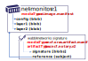
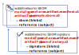

# ORAS Artifact Scenarios

There are a set of supply chain scenarios where a graph of artifacts may include signatures, software bill of materials (SBoM), and security scan results to be associated with an artifact the user intends to work with.


By storing independent, but linked artifacts, the existing OCI container image tool chains remain unchanged, while enabling extensions and new tool chains to benefit from distribution based registries. Independent, but linked artifacts enable independent discovery and acquisition, avoiding Trojan Horse attacks and composition of content. 

Registries and tooling that opt-into `artifacts.manifest`  support can find the referenced artifacts without requiring changes to existing image tool chains, or implementing workarounds that keep content from being garbage collected.

## Reference Type Requirements

Artifact reference types support the following requirements:

- Adding related artifacts, maintaining the original artifact digest and collection of associated tags.
- `many:1` references, enabling multiple signatures, SBoMs, images with on-demand loading to be linked to a single artifact.
- Build atop the existing distribution-spec push and pull APIs.
- Avoiding the need to tag an artifact to assure its not garbage collected as an untagged manifest.
- Discovery, based on the subject artifact. Consumers need not know the specific digest for a signature. Rather a registry client discovers a list of references based a provided tag or digest.
- Copying a graph of references within and across ORAS Artifact enabled, distribution spec based registries, enabling an image, its signatures, SBoMs and images with on-demand loading to be copied as a collection.

To support the above requirements, reference artifacts (eg signatures, SBoMs, images with on-demand loading) may be stored as individual, untagged [ORAS Artifacts][oci-artifacts].
They are maintained as any other artifact in a registry, supporting standard operations such as listing, deleting, garbage collection and any other content addressable operations within a registry.
Untagged artifacts are considered not subject to garbage collection if they have a `subject` reference to an existing artifact. See [Lifecycle Management][lifecycle-management] for details.

### Reference Types Primitives
- **Reference**: a means to add an artifact to a registry, referencing existing, unchanged, content.
- **Reference Discovery API**, where the consumer finds referenced artifacts by querying what artifacts are related to a `subject` artifact.  
  For example, what signatures or SBoMs are related to the `net-monitor:v1` container image. See the [manifest-referrers api][referrers-api] for details.
- **Lifecycle management**: as content is added to a registry, how is its lifecycle handled? Can a user find and delete reference artifacts, and how would a registry garbage collect unreferenced content.  
  As registries implement the [distribution-spec][oci-distribution-spec], content may be stored indefinitely. To assure registries MAY implement garbage collection, a manifest is used to identify the intent of the content. The spec doesn't dictate how an lifecycle management must be implemented, rather focuses on a set of consistent expectations for users to have when working across different implementations.

For spec details: [artifact-manifest.md](./artifact-manifest.md)

### Example ORAS Artifact Manifests

- [`net-monitor:v1` oci container image](./examples/net-monitor-oci-image.json)
- [`net-monitor:v1` notary v2 signature](./examples/net-monitor-image-signature.json)
- [`net-monitor:v1` sample sbom](./examples/net-monitor-image-sbom.json)
- [`net-monitor:v1` nydus image with on-demand loading](./examples/net-monitor-image-nydus-ondemand-loading.json)

## Artifact Graph Example

The fictional Wabbit Networks software company distributes network monitoring software. They wish to distribute a signed container image, with a signed SBoM. To support end users pulling their network monitoring software from public registries into privately managed environments, Wabbit Networks publishes a graph of signed artifacts.

### Example Image

The `net-monitor:v1` container image consists of a `config` and a collection of `layers`, as defined by the [oci.image][oci-image-manifest-spec] spec.


The `net-monitor:v1` container image is persisted as an `oci.image.manifest`, with a unique digest.


- **repository**: `net-monitor`
- **digest**: `sha256:73c803930ea3ba1e54bc25c2bdc53edd0284c62ed651fe7b00369da519a3c333`
- **tag**: `:v1`
> **NOTE:** There is no change to the existing image-spec 1.0 format. The image may be persisted with `oci.image.manifest` or `docker.manifest` schemas. This example highlights what already exists.
  ```json
  {
    "schemaVersion": 2,
    "config": {
      "mediaType": "application/vnd.oci.image.config.v1+json",
      "digest": "sha256:e752324f6804d5d0b2c098f84507d095a8fd0031cf06cdb3c7ad1625dcd1b399",
      "size": 7097
    },
    "layers": [
      {
        "mediaType": "application/vnd.oci.image.layer.v1.tar+gzip",
        "digest": "sha256:83c5cfdaa5385ea6fc4d31e724fd4dc5d74de847a7bdd968555b8f2c558dac0e",
        "size": 25851449
      },
      {
        "mediaType": "application/vnd.oci.image.layer.v1.tar+gzip",
        "digest": "sha256:7445693bd43e8246a8c166233392b33143f7f5e396c480f74538e5738fb6bd6e",
        "size": 226
      }
    ]
  }
  ```

### Notary v2 Signatures

Following the [oras.artifact.manifest][artifact-manifest-spec] spec, a signature is pushed with an `manifest.artifactType`, and a `subject` The signature is persisted in the `[blobs]` collection, and a `subject` referencing the `net-monitor:v1` container image (by digest).



**An Artifact Manifest, capturing the Notary v2 signature of the `net-monitor:v1` container image:**

- **repository**: `net-monitor`
- **digest**: `sha256:8ac803930ea3ba1e54bc25c2bdc53edd0284c62ed651fe7b00369da519a3c222`
- **tag**: _-none-_
  ```json
  {
    "mediaType": "application/vnd.cncf.oras.artifact.manifest.v1+json",
    "artifactType": "org.cncf.notary.v2",
    "blobs": [
      {
        "mediaType": "application/tar",
        "digest": "sha256:9834876dcfb05cb167a5c24953eba58c4ac89b1adf57f28f2f9d09af107ee8f0",
        "size": 32654
      }
    ],
    "subject": {
      "mediaType": "application/vnd.oci.image.manifest.v1+json",
      "digest": "sha256:73c803930ea3ba1e54bc25c2bdc53edd0284c62ed651fe7b00369da519a3c333",
      "size": 16724
    },
    "annotations": {
      "org.cncf.notary.v2.signature.subject": "wabbit-networks.io"
    }
  }
  ```

### SBoM

The same `net-monitor:v1` container image may have an associated SBoM.
The SBoM content would be persisted as one or more `[blobs]` with a `subject` referencing the `net-monitor:v1` container image (by digest).


- **repository**: `net-monitor`
- **digest**: `sha256:7a781a3930ea3ba1e54bc25c2bdc53edd0284c62ed651fe7b00369da519a3c1a`
- **tag**: _-none-_
  ```json
  {
    "mediaType": "application/vnd.cncf.oras.artifact.manifest.v1+json",
    "artifactType": "example.sbom.v0",
    "blobs": [
      {
        "mediaType": "application/tar",
        "digest": "sha256:9834876dcfb05cb167a5c24953eba58c4ac89b1adf57f28f2f9d09af107ee8f0",
        "size": 32654
      }
    ],
    "subject": {
      "mediaType": "application/vnd.oci.image.manifest.v1+json",
      "digest": "sha256:73c803930ea3ba1e54bc25c2bdc53edd0284c62ed651fe7b00369da519a3c333",
      "size": 16724
    },
    "annotations": {
      "example.sbom.author": "wabbit-networks.io"
    }
  }
  ```

The  `net-monitor:v1` SBoM may also be signed, providing yet another leaf node.



- **repository**: `net-monitor`
- **digest**: `sha256:ea0cfb27fd41ea0405d3095880c1efa45710f5bcdddb7d7d5a7317ad4825ae14`
- **tag**: _-none-_
  ```json
  {
    "mediaType": "application/vnd.cncf.oras.artifact.manifest.v1+json",
    "artifactType": "org.cncf.notary.v2",
    "blobs": [
      {
        "mediaType": "application/tar",
        "digest": "sha256:9834876dcfb05cb167a5c24953eba58c4ac89b1adf57f28f2f9d09af107ee8f0",
        "size": 32654
      }
    ],
    "subject": {
      "mediaType": "application/vnd.cncf.oras.artifact.manifest.v1+json",
      "digest": "sha256:7a781a3930ea3ba1e54bc25c2bdc53edd0284c62ed651fe7b00369da519a3c1a",
      "size": 16724
    },
    "annotations": {
      "org.cncf.notary.v2.signature.subject": "wabbit-networks.io"
    }
  }
  ```

### Artifact Graphs

Once all artifacts are submitted, the registry would represent a graph of the `net-monitor:v1` container image, including a signature, an SBoM, and a signature on the SBoM.


The Notary v2 signature and SBoM reference the `net-monitor:v1` container image (as a digest) through the `subject` property.
The `net-monitor:v1` container image is represented as an oci-image, and requires no changes to its manifest to support the enhancements.
The directionality of the `subject` reference enables links to existing content, without changing the existing content.

### Deletion and Ref Counting

The `subject` reference is a hard reference.
Just as the layers of an OCI Image are deleted, any artifacts with a `subject` referring to the target manifest MAY be deleted.

See [Lifecycle Management Spec][lifecycle-management] for details.

## Artifact Manifest Scenarios

The main scenarios include:

1. [Content Discovery](#content-discovery)
1. [Content Promotion Within and Across Registries](#content-promotion-within-and-across-registries)
1. [Lifetime management](#lifetime-management), including deletion of artifacts and their linked manifests.

### Content Discovery

Registries support listing content within a repository.
A container image, multi-arch container image, Helm Chart, WASM and other ORAS Artifact types may be listed based on their `manifest.config.mediaType`.

### Flat Listings 

Prior to the `artifact.manifest`, artifacts are pushed to a registry as independent artifacts.

In the following example, all the artifacts are displayed without relation to each other.
The image signature, SBoM, SBoM signature, Helm signature are listed with digests as they have no individual identity. Without the `artifact.manifest.subject` property, the registry has no direct knowledge these artifacts are references of the image, SBoM or Helm chart.


### Hierarchical Listings

In the following example, the Notary v2 signature, an SBoM and a collection of attributes may be displayed as hierarchical graph.

The references may be expanded or collapsed as the `oras.artifact.manifest` provides reference information, based on the `artifact.manifest.subject` property.


The `:v1` tagged artifact may be expanded to see the references:


See the [/referrers][referrers-api] API for more information on discovering artifact graphs.

## Content Promotion Within and Across Registries

Artifacts are promoted within and across registries.
They may be imported from a public registry to a private registry, or promoted from dev, through test, to production.
They may continue promotion to a public distribution point or deployment to an air-gapped environment.
As artifacts are promoted, content related to that artifact must be capable of being promoted to maintain access to all relevant supply chain content within the promoted environment.

The ORAS Artifact manifest enables the creation of a graph of content, providing discovery and promotion without knowledge of any specific artifact type.

### Example of Content Movement Within

The following represents container images and charts created by the Wabbit Networks fictional software company. The container images, charts with associated SBoMs and signatures are published on a public registry:

```bash
products.wabbit-networks.io/
  net-monitor:v1
  net-monitor:v2
  net-monitor:v3
  net-monitor-chart:v1
  net-monitor-chart:v2
  net-monitor-chart:v3
```

ACME Rockets is fictional consumer of Wabbit Networks software. To assure ownership of artifacts ACME depends upon, they import dependent artifacts and their supply chain references to their private registries. 

The single ACME Rockets registry has `dev\`, `staging\` and `prod\` repositories. As ACME Rockets users promote content, they may promote a subset that passes validation tests.

```bash
registry.acme-rockets.io/
  dev\
    net-monitor:v1
    net-monitor:v2
    net-monitor:v3
    net-monitor-chart:v1
    net-monitor-chart:v2
    net-monitor-chart:v3
  staging/
    net-monitor:v2
    net-monitor:v3
    net-monitor-chart:v2
    net-monitor-chart:v3
  prod/
    net-monitor:v2
    net-monitor-chart:v2
```

### Example of Content Across Registries

As ACME Rockets enforced private network configurations, they split their `dev\`, `staging\` and `prod\` registries, which each in their own private network. As ACME Rockets users promote content, they may promote a subset that passes validation tests across the registries.

```bash
dev-registry.acme-rockets.io/
  net-monitor:v2
  net-monitor:v3
  net-monitor-chart:v2
  net-monitor-chart:v3

staging-registry.acme-rockets.io/
  net-monitor:v2
  net-monitor:v3
  net-monitor-chart:v2
  net-monitor-chart:v3

prod-registry.acme-rockets.io/
  net-monitor:v2
  net-monitor-chart:v2
```

## Content Copying

ORAS Artifacts enables generic content, and optional references through the `subject` property. These create artifact graphs that enable copying of content with generalized registry clis. The registry clis need not know any details about the specific artifact type.

### Copying an OCI Image

As an example, copying a container image from a public registry to a private registry could involve `docker pull`, `docker tag` and `docker push`

```bash
docker pull wabbitnetworks/net-monitor:v1
docker tag wabbitnetworks/net-monitor:v1 registry.acme-rockets.io/base-artifacts/net-monitor:v1
docker push registry.acme-rockets.io/base-artifacts/net-monitor:v1
```


The above commands account for the `oci.image.manifest` and the associated layers.
Note the directionality of the manifest `-->` config and layer references.
A manifest declares a `config` and `layers` that must be accounted for before a manifest may be considered valid within a registry.

### Copying an OCI Image with Artifact References

Using the ORAS Artifact Manifest, signatures, SBoMs and signatures on the SBoMs may be persisted.

In the below example, Notary v2 signatures and a Notary v2 signed SBoM have been added to the `net-monitor:v1` container image.
Note the directionality of the SBoM and Notary v2 signature references.
The Notary v2 signature and SBoM `-->` reference the `net-monitor:v1` container image.
From a user experience perspective, copying an image from a public registry to a private registry should likely copy the signatures and SBoM alongside the artifact they've signed.
The Artifact manifest provides the information needed for a registry to index references from either direction.


### OCI-Registry CLI

To copy the above container image and the referenced signatures, a prototypical `oci-reg` cli is used for illustrative purposes.
The `oci-reg` cli is an example of tools that _could_ be built by the community, as they would work within and across different OCI and ORAS Artifact conformant registry implementations.

The following command would copy the `net-monitor:v1` container image from docker hub to the acme-rockets registry.
The CLI _could_ be run within the source or target cloud eliminating the download/upload network hops.

```bash
oci-reg copy \
  --source docker.io/wabbitnetworks/net-monitor:v1 \
  --target registry.acme-rockets.io/base-artifacts/net-monitor:v1
```

The `oci-reg copy` command would:

- assure the manifest and layer/blob digests remain the same
- copy any additional artifacts that contain a `subject` of the `net-monitor:v1` digest. These _could_ include Notary v2 signatures, SBoMs, GPL source or other referenced artifacts.

Since the artifacts are individually stored in a registry, shallow copies can be made:

**Example**: Optional parameters to include|exclude reference types:

```bash
oci-reg copy \
  --source docker.io/wabbitnetworks/net-monitor:v1 \
  --target registry.acme-rockets.io/base-artifacts/net-monitor:v1 \
  --copy-references disabled
```

As the referenced types are defined by the `manifest.subject`, copying specific content may be enabled:

**Example**: Filter by `artifactType`:

```bash
oci-reg copy \
  --source docker.io/wabbitnetworks/net-monitor:v1 \
  --target registry.acme-rockets.io/base-artifacts/net-monitor:v1 \
  --include-references org.cncf.notary.v2
```

### Lifecycle Management

Using the ORAS Artifact manifest, OCI distribution-spec APIs may provide standard delete operations, including options for deleting referenced artifacts.
The registry, nor the `oci-reg` cli would need to know about specific artifact type implementations.

**Example**: Deleting container images, with Notary v2 and SBoM references:

```bash
oci-reg delete registry.acme-rockets.io/net-monitor:v1
```

**Example**: Deleting all artifact references:

```bash
oci-reg delete-references registry.acme-rockets.io/net-monitor:v1
```

**Example**: Deleting specific  references by `artifactType`:

```bash
oci-reg delete-references \
  --referenceType org.cncf.notary.v2 \
  registry.acme-rockets.io/net-monitor:v1
```

**Example**: Deleting a specific artifact reference:

```bash
oci-reg delete registry.acme-rockets.io/net-monitor@sha256:b5b2b2c507a0944348e0303114d8d93aaaa081732b86451d9bce1f432a537bc7
```

## Further Reading

- [artifact-manifest spec][artifact-manifest-spec]
- [Referrers API][referrers-api] for more information on listing references

[lifecycle-management]:               ./artifact-manifest.md#lifecycle-management
[oci-image-manifest-spec]:            https://github.com/opencontainers/image-spec/blob/master/manifest.md
[oci-artifacts]:                      https://github.com/opencontainers/artifacts
[artifact-manifest-spec]:             ./artifact-manifest.md
[oci-distribution-spec]:              https://github.com/opencontainers/distribution-spec
[referrers-api]:                      ./manifest-referrers-api.md
